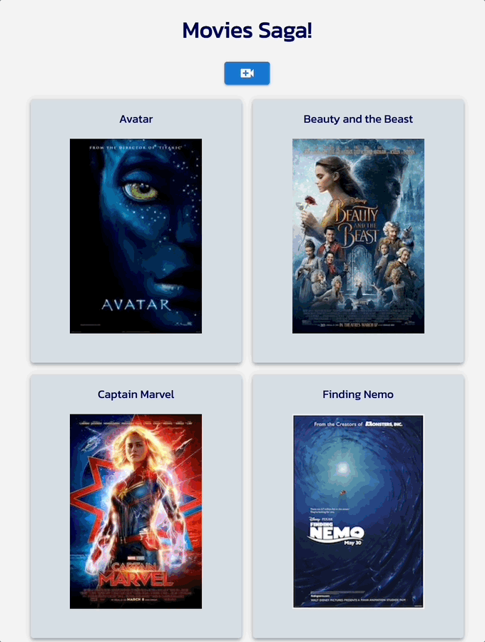

# Movies Saga

## Description

Movies Saga is an app that catalogs a user's favorite movies and showcases their title, poster image, description, and genre(s). Built with React.js and Redux-Saga, Movies Saga also allows a user to add, update, and delete movies. Movie data is stored in an SQL database. 

## Demo

    

### Prerequisites

- [Node.js](https://nodejs.org/en/)
- [Nodemon](https://www.npmjs.com/package/nodemon)
- [PostgreSQL](https://www.postgresql.org/)

## Installation

1. Create a database named `saga_movies_weekend` and execute the query from `database.sql` to create the `movies`, `genres`, and `movies_genres` tables. 
2. Within your code editor, open a terminal window and install the dependencies by running:
    - `npm install`
3. Run `npm run server` in one terminal window. Open a second terminal window, and run `npm run client`. Access the application at `localhost:3000/#/` in the browser.

## Usage

1. Click a movie poster to see details about that movie including its description and genre(s). 
2. Within details, edit a movie by clicking the `EDIT` button. You can edit the title, image URL, and movie description. Once complete, click `SAVE` and you'll be routed back to details for that movie to see your edits in effect. If you decide not to edit the movie, click `CANCEL`.
3. Within details, delete a movie by clicking the `DELETE` button. You'll be prompted to confirm before deleting and then routed back to the list of movies.
4. To add a movie, click the blue video button at the top of the page. You'll be routed to a form where you can enter the new movie's title, poster URL, and description. Use the dropdown to select the movie's genre. Click `SAVE` to add the movie. Click `BACK` to return to the list of the movies but preserve the information already entered in the form. Click `CLEAR` to clear the data entered in the form. 

## Built With

Redux-Saga | Redux | React.js | Material UI | Axios | PostgreSQL | Node.js | Express
